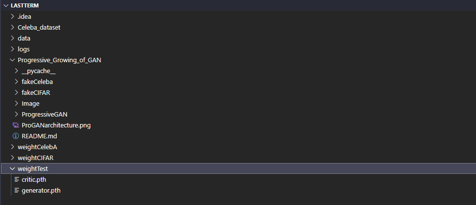
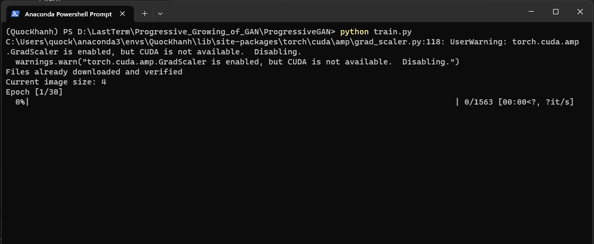
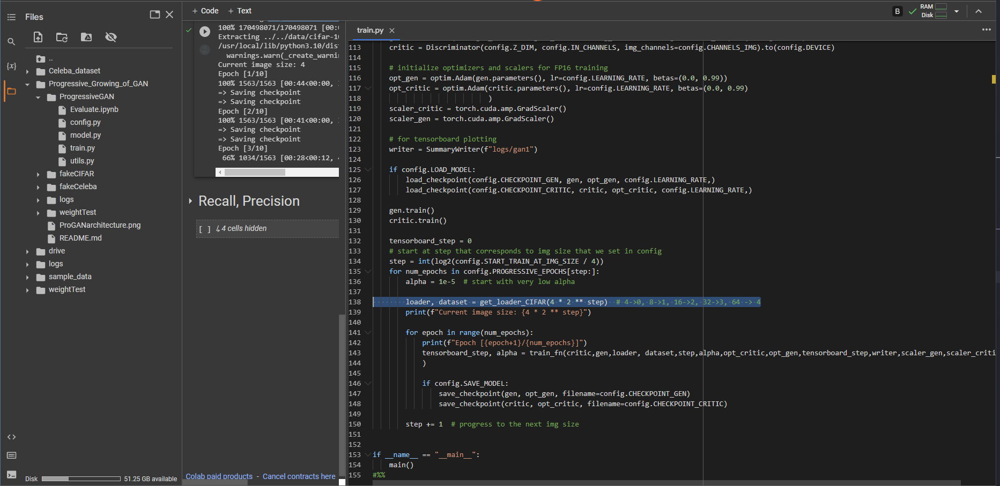

# 📚 Trường đại học Phenikaa

### Source Code Bài tập lớn cuối kỳ môn Deep Learning
### Đề tài: mô hình sinh ảnh Progressive Growing of GAN trên tập dữ liệu CIFAR10 và CELEBA 

## Sử dụng: 

         - Pytorch, numpy: Load dataset, build model
         - Tensorboard, opencv, matplotlib: Hiển thị kết quả sinh được ra 

## Nhóm 8: 

                                      | Nguyễn Quốc Khánh| Đỗ Trọng Hiệp |
                                      |     21011495     |   21011492    |  
                                      |     K15-KHMT     |   K15-KHMT    |

## Hướng dẫn chạy code trên máy cá nhân:

Clone code từ git

         git clone https://github.com/qkhanh711/Progressive_Growing_of_GAN.git

Tải xuống CelebA dataset theo link:

        https://drive.google.com/file/d/1zptgH6nwHJgdBPD34PLewYr2ONyRe9g7/view?usp=share_link

Tải xuống file lưu weight từ mô hình sau khi train 2 bộ datasets CIFAR10 và CelebA:

        https://drive.google.com/file/d/1Tmp6SrAaB7YP8cNg0wDM1JQ7ENOVnyDi/view?usp=drive_link

Tổ chức file code theo dạng:

        LastTerm/
            Celeba_dataset/
            logs/
            Progressive_Growing_of_GAN
                fakeCeleba/
                fakeCIFAR/
                Image/
                ProgressiveGAN/
                    config.py
                    Evaluate.ipynb
                    model.py
                    train.py
                    utils.py
                ...
            weightCelebA/
            weightCIFAR/
            weightTest/
            ...

## Ví dụ

## Mở terminal, di chuyển tới thư mục ProgressiveGAN, nhập câu lệnh:

            python train.py

## Đánh giá mô hình trên file Evaluate.ipynb

## Chạy code trên google colab trên Celeba dataset

**Bước 1:** Mở google Colab bằng link sau

         https://colab.research.google.com/drive/1ViZz99EZOxQKe6cGr9OKH4J4TpN4JYX0#scrollTo=K8RsXNYeCdg4

**Bước 2:** Kết nối và tải file archive.zip (Celeba dataset) lên google drive

**Bước 3** Mở file train.py -> Dòng 138 (Phần bôi đen) thay đổi thành:

        loader, dataset = get_loader(4 * 2 ** step, root_path = config.PATH_COLAB)

**Bước 4** Chọn Runtime -> Run All

